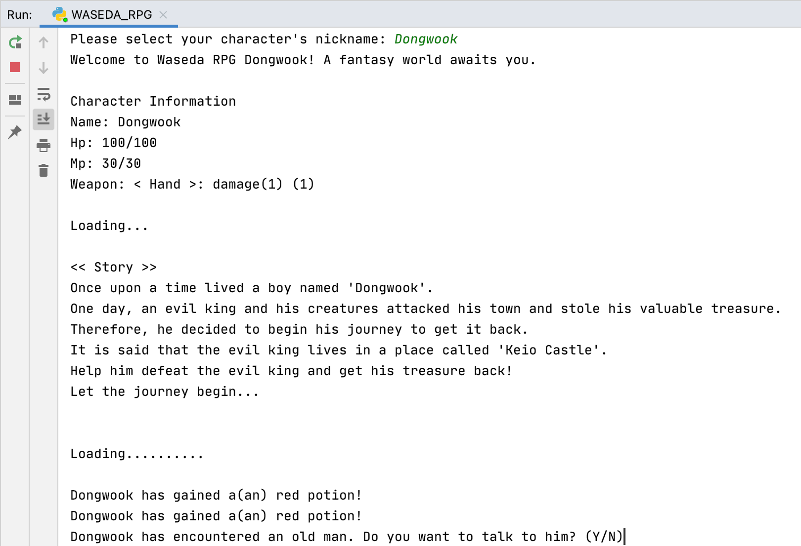

## WASEDA RPG

This is a final project for Advanced Computer Programming 01 (INFN301L) class of Waseda University held in 2019. 

---

- It is a simple RPG game built purely by using python class methods. 

- Main story of this game is an adventure towards the evil king of Keio castle. Motivated by Dragon Quest.

- There are sub-games as well such as the pachinko (gamble), bulls and cows et cetera.

---

### Screenshot of game play
